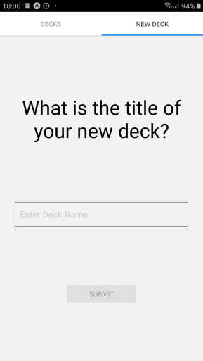

# Flash Cards

Flash Cards is a studying app to help students retain their memory. The app is the third and final project in Udacity's React nanodegree. It's considered to be the practical implementation of React Native. But, here it's upgraded to use Redux store for centralized state management.


The logic of the app goes around adding multiple decks and each deck can have multiple cards added to it. The card is consisted of a question and an answer. And the student can quiz himself on each deck's cards.

The app makes use of AsyncStorage as a local database to keep user data persistent.

The project also makes use of styled components to practice css in js. But, It isn't focused on design and minimal design and styling was added.

The app was bootstrapped using expo command line interface.



## Table of Contents

* [Quick Start](#quick-start)
* [Direct Dependencies](#direct-dependencies)
* [File Structure](#file-structure)
* [Contributing](#contributing)

## Quick Start

The installation guide assumes that you have update-to-date nodejs and npm present.

* Install `expo-cli` as npm uses it in background to run the app
  `npm i -g expo-cli`

* Clone the project
  `git clone https://github.com/i-mw/flash-cards`

* Cd to the project
  `cd flash-cards`

* Install all dependencies
  `npm install` or `expo install`

* run the app
  `npm start` or `expo start`

* Then you have multiple options to view the app:
  * Download `expo` app on google play or app store and use it to scan the QR code to view on top of expo app.
  * click `w` to view it on the web. N.b. Notifications API doesn't work on the web just yet.
  * click `a` to view on android emulator (if you have installed).
  * click `i` to view on ios emulator (if you have installed).


## Direct Dependencies

The project has these direct code dependencies, as indicated in `package.json` file:

*  @react-native-community/masked-view
*  @react-navigation/material-top-tabs
*  @react-navigation/native
*  @react-navigation/stack
*  expo
*  react
*  react-dom
*  react-native
*  react-native-gesture-handler
*  react-native-paper
*  react-native-reanimated
*  react-native-safe-area-context
*  react-native-screens
*  react-native-tab-view
*  react-native-vector-icons
*  react-native-web
*  react-redux
*  redux
*  redux-thunk
*  styled-components
*  expo-permissions

And these Development dependencies:
  babel-preset-expo
  @babel/core

## File Structure

The project uses 'rails-type' file structure

```bash
─── src
    ├── components 
    ├── actions
    ├── reducers
    ├── middleware
    ├── utils
    └── App.js
```

## Expo

This project was bootstrapped with [Expo-cli](https://docs.expo.io/versions/latest/workflow/expo-cli).

## Contributing

As this project is part of a program and meant only for personal improvement, Its not open for contribution. But you can refer to a feature or a bug in Issues section.
